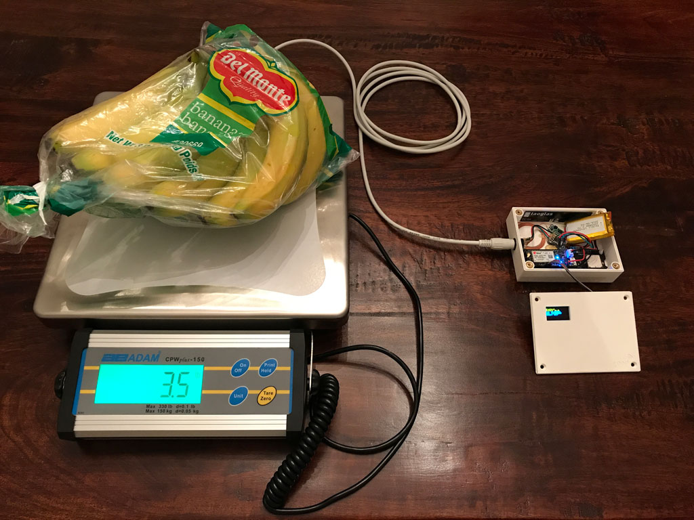
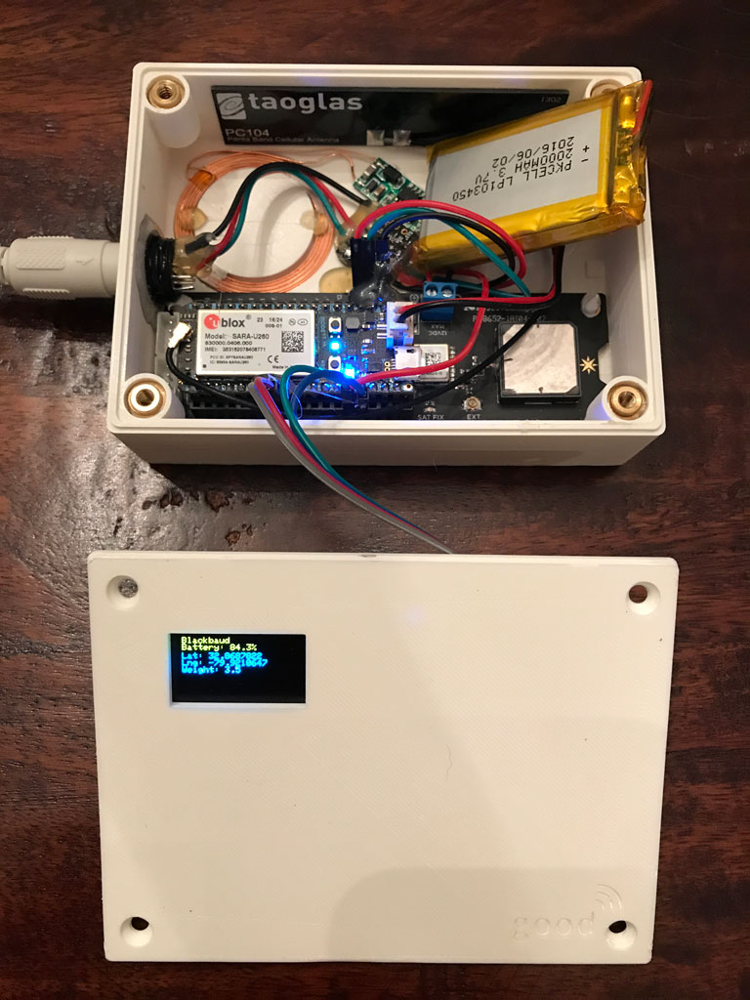

# IoT Food Scale

IoT Food Scale is an experimental scale that is internet-connected and portable. It's great for food drives and other events that help fight hunger.

# How it works

IoT Food Scale adds GPS and cellular connectivity features to a common shipping scale so that donated food can be weighed at an event and the running total can be viewed from anywhere.

# Guide: How to make IoT Food Scale

This guide gives you an overview of how to create the IoT Food Scale, from procuring the necessary parts, 3D printing the enclosure, soldering connections, and finally loading the software.

### 1. Purchase the parts

Here is the shopping list (aka bill of materials).

Quantity | Description | Link
---------| ----------- | ----
1 | Particle Electron | (https://store.particle.io/products/electron-3g-americas)
1 | Particle Asset Tracker v2 | (https://store.particle.io/products/asset-tracker)
